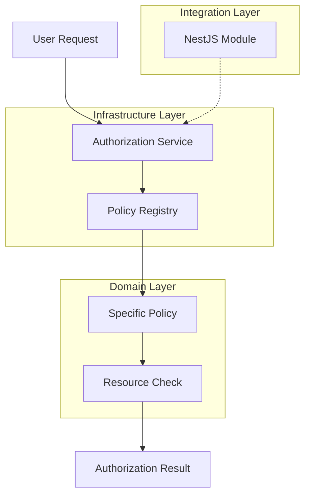

# Architecture Overview

The Policy-Based Authorization System is designed with Clean Architecture principles, separating domain logic from infrastructure and application concerns.

## Core Components

- **Authorization Policies**: Encapsulate rules for resource access
- **Resource Decorators**: Mark classes as authorizable resources  
- **Authorization Service**: Central service to evaluate policies
- **NestJS Module**: Seamless integration with NestJS DI and modules

## System Flow

This separation ensures testability, maintainability, and extensibility by keeping business logic independent of framework concerns.